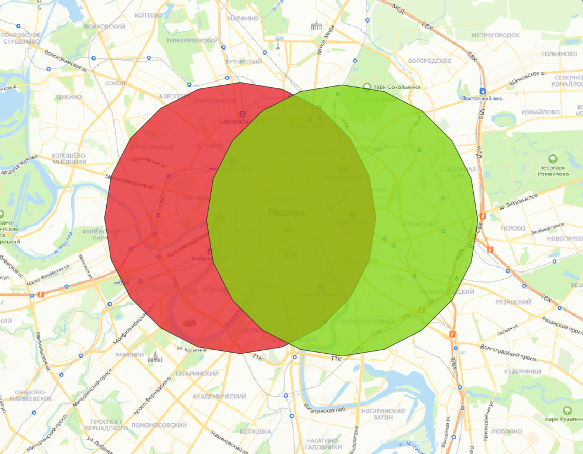
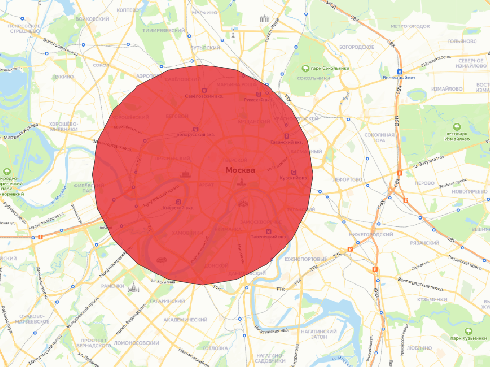
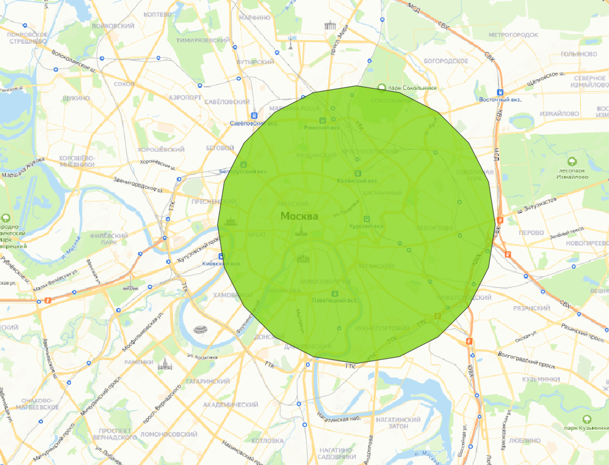
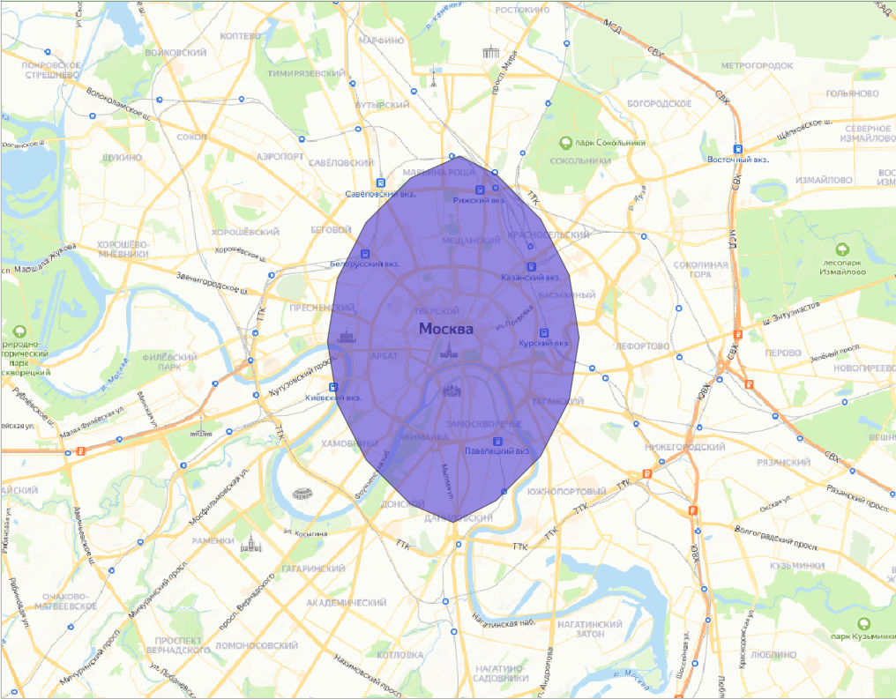

# Описание тестового задания

## Исходная ситуация
- **БД**: схема `app`, таблица `points`, в которой содержатся исходные данные
- **Backend**: `flask`-сервер, который на эндпоинт `/` возвращает все объекты из таблицы в формате `geojson`
- **Frontend**: карта, на которой отображаются все исходные данные

## Цель
Развить текущий функционал: добавить возможность просмотра как всего слоя, так и отдельных объектов (по типу) и их пересечения

## Задачи и условия
- создать в нижнем правом углу компонент управления
- компонент управления должен содержать заголовок, краткое описание, а также переключатель с 4 вариантами:
1. Показать А и В 

2. Показать только А

3. Показать только В

4. Показать пересечение А и В

- после переключения комбобокса данные на карте должны отображаться без подтверждения
- карта должна отображать текущий выбор в управлении. Иными словами, если мы выбрали 2й пункт после 1го, то мы должны видеть только 2й пункт, но не 1й и 2й
- все данные для отображения должны присылаться с бэка, а не быть результатом обработки на фронте
- пересечение должно генерироваться динамически, а не путем изменения исходных данных

## Запуск приложения
### Вручную
- **БД**: нужно развернуть локально `postgres` с установленным `postgis` с паролем `admin`

- **Backend**: 
0. Перейти в папку `./backend`
1. Создать виртуальное окружение с установкой модулей из `requirements.txt`
2. Запустить из-под окружения сервер командой `flask --debug run --host 0.0.0.0`

- **Frontend**:
0. Перейти в папку `./frontend`
1. Установить глобально Angular `npm install -g @angular/cli`
2. Установить модули проекта `npm install`
3. Запустить приложение `ng serve --host 0.0.0.0 --open`

### Docker
Запускаем из корня проекта командой `docker compose up -d`